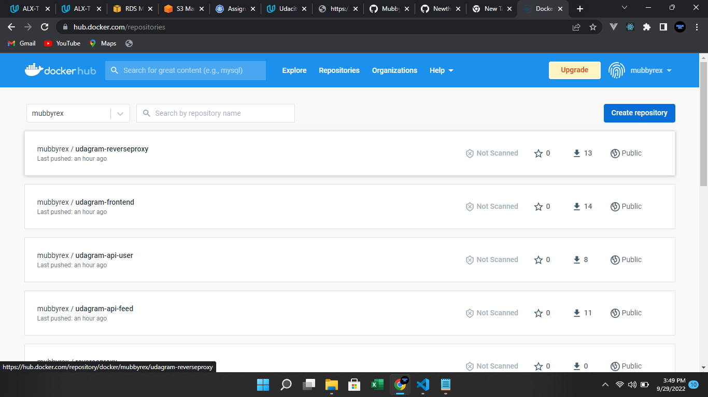

#Project Walkthrough

### 1. Database

I create a PostgreSQL database on AWS RDS. The database is used to store the application's metadata.

- We will need to use password authentication for this project. This means that a username and password is needed to authenticate and access the database.
- The port number will need to be set as `5432`. This is the typical port that is used by PostgreSQL so it is usually set to this port by default.

configured my AWS RDS fields with the following values on the AWS console

| Field                                                | Value                                                                              |
| ---------------------------------------------------- | ---------------------------------------------------------------------------------- |
| Database creation method                             | Standard create. Easy create option creates a private database by default          |
| Engine option                                        | PostgreSQL 12 or higher                                                            |
| Templates                                            | Free tier                                                                          |
| DB instance identifier, master username and password | Your choice                                                                        |
| DB instance class                                    | Burstable classes with minimal size                                                |
| Database name                                        | postgres                                                                           |
| VPC and subnet                                       | Default                                                                            |
| Public access                                        | YES. Allows application running outside of your AWS account discover the database. |
| VPC security group                                   | Either choose default or create a new one                                          |
| Availability Zone                                    | No preference                                                                      |
| Database port                                        | 5432 (default)                                                                     |

### 2. S3 Bucket creation

I created an AWS S3 bucket. The S3 bucket is used to store images that are displayed in Udagram.
I added a policy in json format to my bucket

```
{
 "Version":"2012-10-17",
 "Statement":[
     {
         "Sid":"Stmt1625306057759",
         "Principal":"*",
         "Action":"s3:*",
         "Effect":"Allow",
         "Resource":"arn:aws:s3:::my-467286114294-bucket"
     }
 ]
}
```

I also added configured CORS

````
[
	{
		"AllowedHeaders":[
			"*"
		],
		"AllowedMethods":[
			"POST",
			"GET",
			"PUT",
			"DELETE",
			"HEAD"
		],
		"AllowedOrigins":[
			"*"
		],
		"ExposeHeaders":[

		]
	}
]```
````

### Conversion of Monolith features to microservices

Created two backend directories

- udagram-api-feed
- udagram-api-user

I then split the code of my backend directory into the two new directories, so they run independently of each other

Created similar DockerFILEs in both backend directories since they require the same dependencies

[Backend-feed dockerfile](/udagram-api-feed/Dockerfile)

[Backend-User dockerfile](/udagram-api-user/Dockerfile)

I also created a Dockerfile in the frontend folder

[Frontend dockerfile](/udagram-frontend/Dockerfile)

### Reverse Proxy for communication

I create a new directory called "udagram-reverseproxy" for an application named reverseproxy running the Nginx server. The reverseproxy service will help add another layer between the frontend and backend APIs so that the frontend only uses a single endpoint and doesn't realize it's deployed separately.

This is the structure of my microservices app


Created a 'nginx.conf' file

[nginx.conf file](/udagram-reverseproxy/nginx.conf)

Also a Dockerfile

[Reverseproxy dockerfile](/udagram-reverseproxy/Dockerfile)

### Continuous Integration with Circle CI

I created a pipeline for continous integration

[Circle CI integration file](/.circleci/config.yml)


the images got built and pushed to DockerHub


